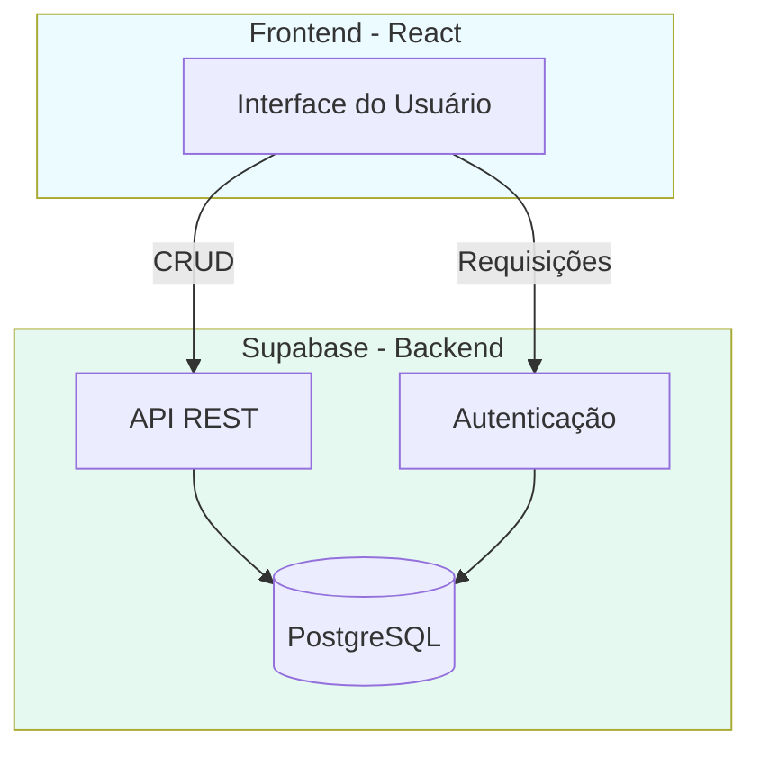
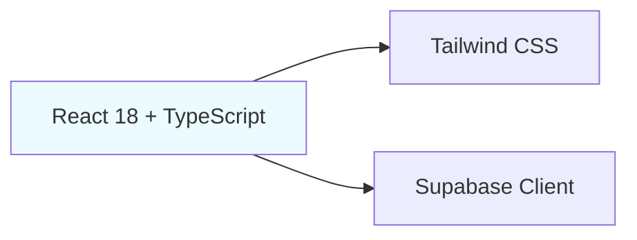
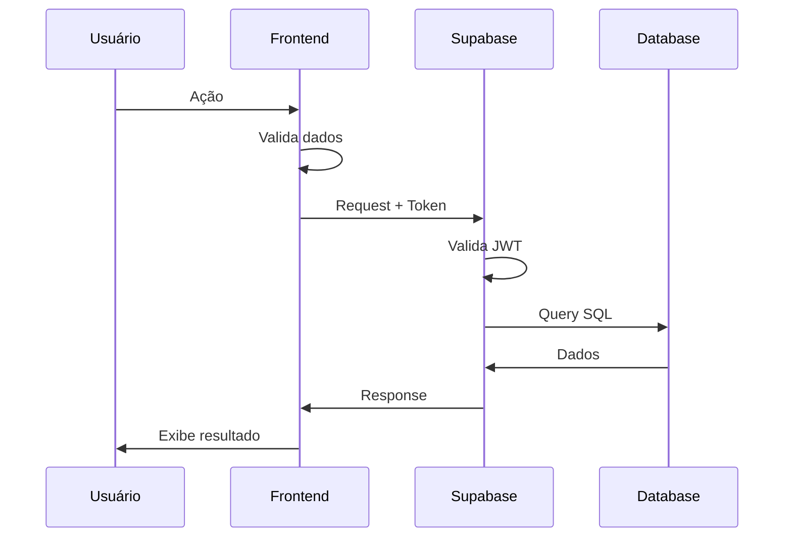
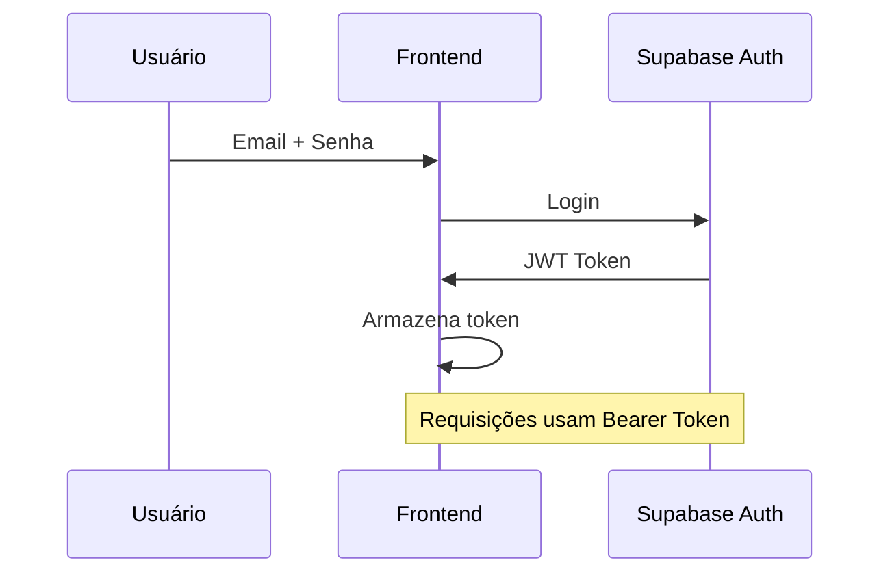
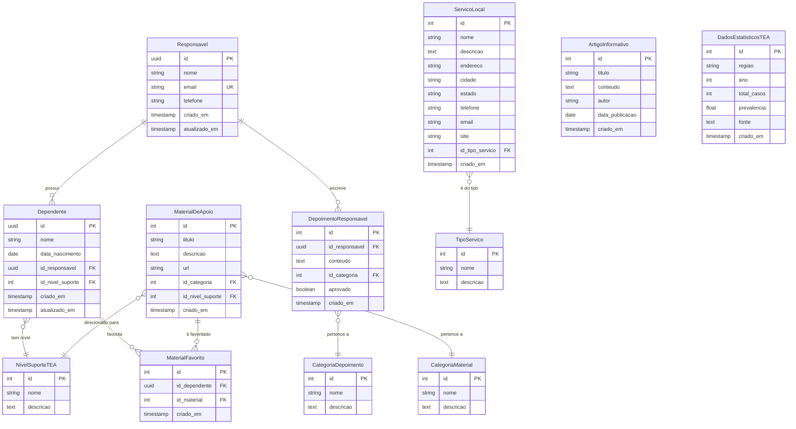
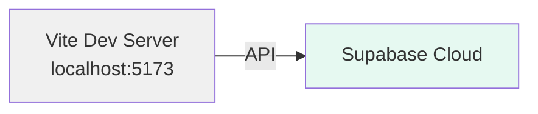
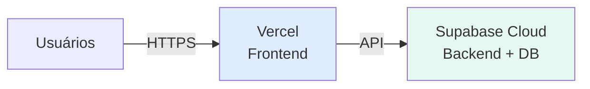
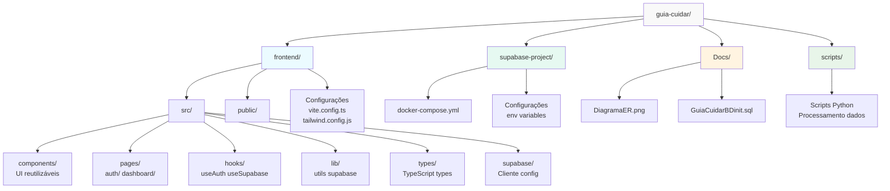

# 🏗️ Arquitetura do Guia Cuidar

## 📐 Arquitetura Conceitual



### Componentes

- **Frontend**: React + TypeScript + Vite
- **Backend**: Supabase (Auth + API + Database)
- **Banco de Dados**: PostgreSQL com Row Level Security

## 🔧 Stack Tecnológico



**Frontend:**
- React 18 + TypeScript + Vite
- Tailwind CSS + Shadcn/ui
- React Router

**Backend:**
- Supabase (BaaS)
- PostgreSQL
- Row Level Security (RLS)

## 🔄 Fluxo de Dados



## 🔐 Segurança

### Autenticação



### Row Level Security (RLS)

```sql
-- Usuários só veem seus próprios dados
CREATE POLICY "user_policy" ON Dependente
FOR ALL USING (auth.uid() = id_responsavel);
```

## 📊 Modelo de Dados



## 🚀 Deployment

### Desenvolvimento



### Produção



## 📁 Estrutura do Projeto



### Detalhamento

```
guia-cuidar/
├── frontend/                    # Aplicação React
│   ├── src/
│   │   ├── components/         # Componentes reutilizáveis
│   │   │   ├── ui/            # Shadcn/ui components
│   │   │   └── layout/        # Header, Footer, Sidebar
│   │   ├── pages/             # Páginas da aplicação
│   │   │   ├── auth/          # Login, Register
│   │   │   └── dashboard/     # Home, Services, Materials, etc
│   │   ├── hooks/             # Custom hooks
│   │   ├── lib/               # Utilitários e helpers
│   │   ├── types/             # Definições TypeScript
│   │   └── supabase/          # Cliente e configuração
│   ├── public/                # Assets estáticos
│   └── supabase/              # Tipos gerados do Supabase
│
├── supabase-project/          # Supabase local (Docker)
│   ├── docker-compose.yml     # Configuração containers
│   └── .env                   # Variáveis de ambiente
│
├── Docs/                      # Documentação
│   ├── DiagramaER.png        # Diagrama do banco
│   └── GuiaCuidarBDinit.sql  # Script de inicialização
│
└── scripts/                   # Scripts auxiliares
    └── *.py                   # ETL de dados estatísticos
```

## 📚 Referências

- [React](https://react.dev/)
- [Supabase](https://supabase.com/docs)
- [TypeScript](https://www.typescriptlang.org/docs/)
- [TanStack Query](https://tanstack.com/query/latest)
- [Tailwind CSS](https://tailwindcss.com/docs)
