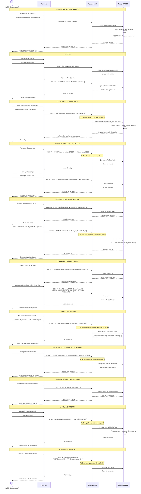

```mermaid
sequenceDiagram
    actor U as Usuário (Responsável)
    participant F as Front-end
    participant API as Supabase API
    participant DB as PostgreSQL DB

    Note over U,DB: 1. CADASTRO DE NOVO USUÁRIO

    U->>F: Acessa tela de cadastro
    U->>F: Preenche dados (nome, email, senha)
    F->>API: signUp(email, senha, metadata)
    API->>DB: INSERT INTO auth.users
    DB->>DB: Trigger: on_auth_user_created
    DB->>DB: INSERT INTO Responsavel (auto)
    DB-->>API: Usuário criado
    API-->>F: Token de autenticação
    F-->>U: Redireciona para dashboard

    Note over U,DB: 2. LOGIN

    U->>F: Acessa tela de login
    U->>F: Insere email e senha
    F->>API: signInWithPassword(email, senha)
    API->>DB: Valida credenciais em auth.users
    DB-->>API: Credenciais válidas
    API-->>F: Token JWT + Session
    F->>API: SELECT * FROM Responsavel WHERE id = auth.uid()
    API->>DB: Query com RLS aplicado
    DB-->>API: Dados do responsável
    API-->>F: Perfil do usuário
    F-->>U: Dashboard personalizado

    Note over U,DB: 3. CADASTRAR DEPENDENTE

    U->>F: Clica em "Adicionar Dependente"
    U->>F: Preenche formulário (nome, nível TEA)
    F->>API: INSERT INTO Dependente (nome, nivel_suporte_tea_id)
    Note over API: RLS verifica: auth.uid() = responsavel_id
    API->>DB: INSERT com responsavel_id = auth.uid()
    DB->>DB: Trigger: update_dependente_timestamp
    DB-->>API: Dependente criado (id, dados)
    API-->>F: Confirmação + dados do dependente
    F-->>U: Exibe dependente na lista

    Note over U,DB: 4. BUSCAR ARTIGOS INFORMATIVOS

    U->>F: Acessa seção de artigos
    F->>API: SELECT * FROM ArtigoInformativo ORDER BY data_criacao DESC
    Note over API: RLS: authenticated users podem ler
    API->>DB: Query com RLS aplicado
    DB-->>API: Lista de artigos
    API-->>F: Array de artigos
    F-->>U: Exibe grid de artigos

    U->>F: Busca por palavra-chave
    F->>API: SELECT * FROM ArtigoInformativo WHERE titulo ILIKE '%keyword%'
    API->>DB: Query com filtro
    DB-->>API: Artigos filtrados
    API-->>F: Resultados da busca
    F-->>U: Exibe artigos relevantes

    Note over U,DB: 5. FAVORITAR MATERIAL DE APOIO

    U->>F: Navega pelos materiais de apoio
    F->>API: SELECT * FROM MaterialDeApoio WHERE nivel_suporte_tea_id = ?
    API->>DB: Query filtrada por nível
    DB-->>API: Materiais compatíveis
    API-->>F: Lista de materiais
    F-->>U: Exibe materiais

    U->>F: Clica em favoritar para dependente específico
    F->>API: INSERT INTO MaterialFavorito (material_id, dependente_id)
    Note over API: RLS: auth.uid() deve ser dono do dependente
    API->>DB: Valida dependente pertence ao responsável
    DB->>DB: INSERT com responsavel_id = auth.uid()
    DB-->>API: Favorito criado
    API-->>F: Confirmação
    F-->>U: Ícone de favorito ativado

    Note over U,DB: 6. BUSCAR SERVIÇOS LOCAIS

    U->>F: Acessa mapa de serviços
    F->>API: SELECT * FROM Dependente WHERE responsavel_id = auth.uid()
    API->>DB: Query com RLS
    DB-->>API: Lista de dependentes
    API-->>F: Dependentes do usuário
    
    U->>F: Seleciona dependente e tipo de serviço
    F->>API: SELECT SL.*, TS.name FROM ServicoLocal SL<br/>JOIN TipoServico TS ON SL.tipo_servico_id = TS.id<br/>WHERE TS.id = ?
    API->>DB: Query com JOIN
    DB-->>API: Serviços locais filtrados
    API-->>F: Lista de serviços
    F-->>U: Exibe serviços no mapa/lista

    Note over U,DB: 7. CRIAR DEPOIMENTO

    U->>F: Acessa seção de depoimentos
    U->>F: Escreve depoimento e seleciona categoria
    F->>API: INSERT INTO DepoimentoResponsavel (texto, categoria_id)
    Note over API: RLS: responsavel_id = auth.uid(), aprovado = FALSE
    API->>DB: INSERT com status pendente
    DB-->>API: Depoimento criado (aguardando aprovação)
    API-->>F: Confirmação
    F-->>U: "Depoimento enviado para análise"

    Note over U,DB: 8. VISUALIZAR DEPOIMENTOS APROVADOS

    U->>F: Navega pela comunidade
    F->>API: SELECT * FROM DepoimentoResponsavel WHERE aprovado = TRUE
    Note over API: RLS permite ver aprovados ou próprios
    API->>DB: Query com filtro de aprovação
    DB-->>API: Depoimentos aprovados
    API-->>F: Lista de depoimentos
    F-->>U: Exibe depoimentos da comunidade

    Note over U,DB: 9. VISUALIZAR DADOS ESTATÍSTICOS

    U->>F: Acessa dashboard de estatísticas
    F->>API: SELECT * FROM DadosEstatisticosTEA
    API->>DB: Query com RLS (authenticated)
    DB-->>API: Dados estatísticos
    API-->>F: Estatísticas e fontes
    F-->>U: Exibe gráficos e informações

    Note over U,DB: 10. ATUALIZAR PERFIL

    U->>F: Edita informações do perfil
    U->>F: Salva alterações
    F->>API: UPDATE Responsavel SET nome = ? WHERE id = auth.uid()
    Note over API: RLS: só pode atualizar próprio perfil
    API->>DB: UPDATE com validação RLS
    DB->>DB: Trigger: update_responsavel_timestamp
    DB-->>API: Perfil atualizado
    API-->>F: Confirmação
    F-->>U: "Perfil atualizado com sucesso"

    Note over U,DB: 11. REMOVER FAVORITO

    U->>F: Clica para desfavoritar material
    F->>API: DELETE FROM MaterialFavorito<br/>WHERE material_id = ? AND dependente_id = ?
    Note over API: RLS valida responsavel_id = auth.uid()
    API->>DB: DELETE com RLS
    DB-->>API: Favorito removido
    API-->>F: Confirmação
    F-->>U: Ícone de favorito desativado

```
